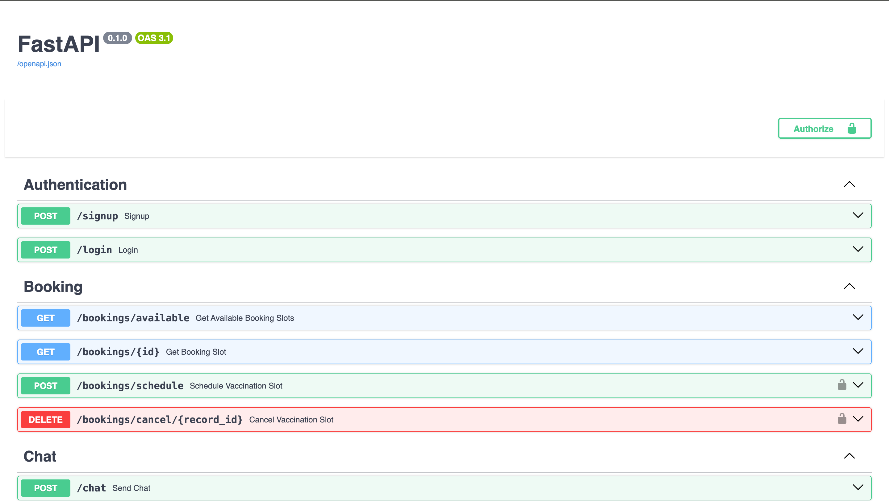
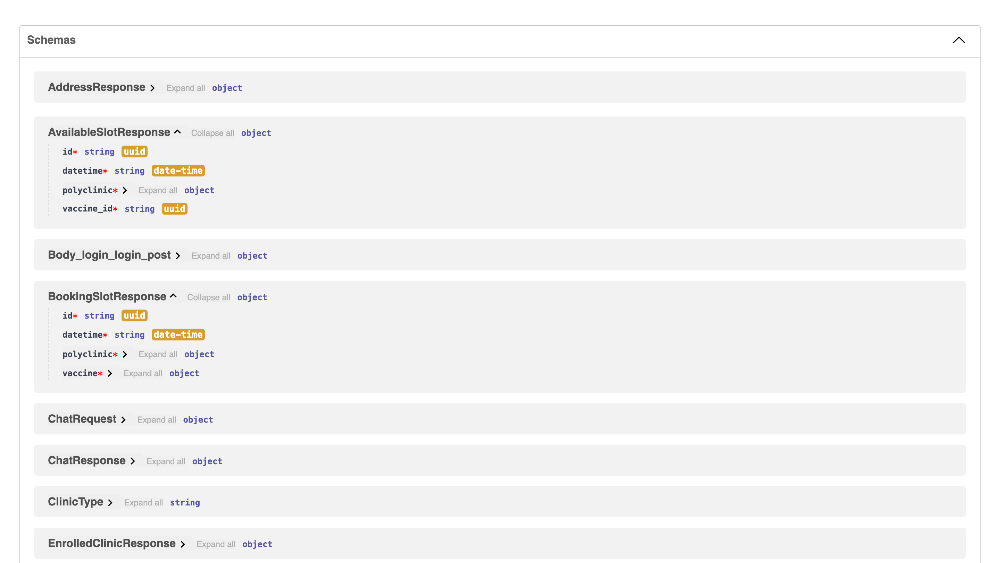
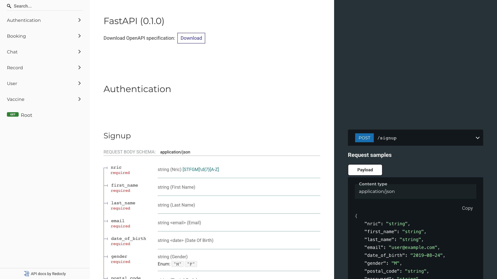
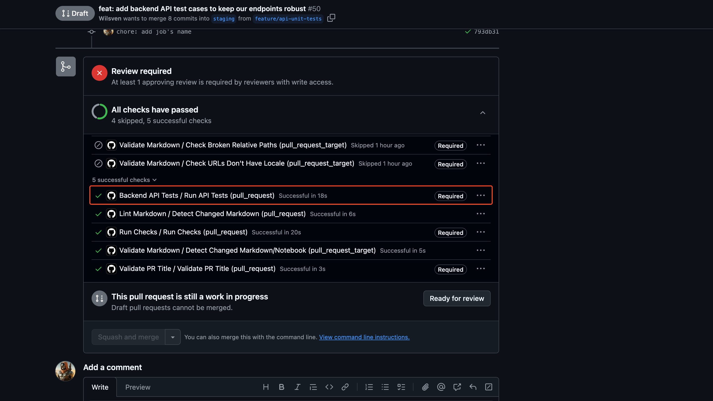
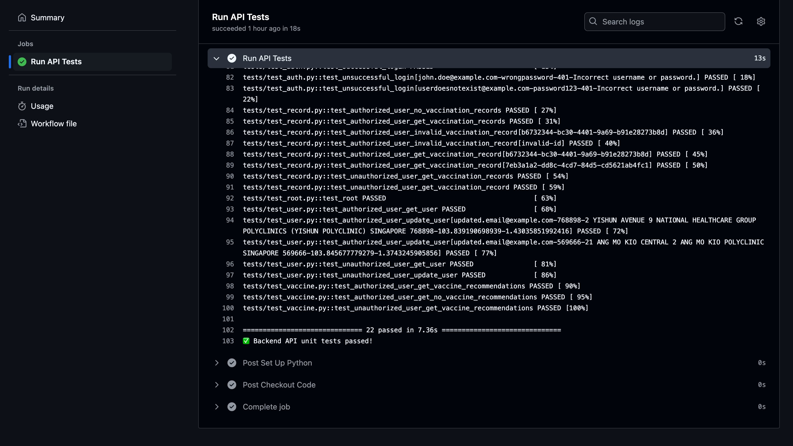

# API Endpoints

## Table of Contents

- [Overview](#overview)
- [Authentication](#authentication)
- [User](#user)
- [Vaccine](#vaccine)
- [BookingSlot](#booking-slot)
- [VaccineRecord](#vaccine-record)
- [Clinic](#clinic)
- [Swagger UI Reference](#swagger-ui-reference)
- [Backend API Test Cases](#backend-api-test-cases)
  - [Test Suite Overview](#test-suite-overview)
  - [Running Tests Locally](#running-tests-locally)
  - [CI Integration with GitHub Actions](#ci-integration-with-github-actions)
- [(Optional) Debugging GitHub Actions Workflows Locally (with `act`)](#optional-debugging-github-actions-workflows-locally-with-act)

## Overview <a id="overview"></a>

This guide outlines the API endpoints provided by the backend, organized by feature/module. For each endpoint, we list the HTTP method, URL path, a brief description of its purpose, and the required authentication (if any). Non-technical readers can read the descriptions to understand what each endpoint does, while developers can get a quick reference of the available endpoints. For detailed request/response schemas and examples, you can refer to the interactive API docs (Swagger UI) as described in the next section — we avoid duplicating the payload details to keep things concise.

Below is an overview of the API endpoints, grouped by module:

## Authentication <a id="authentication"></a>

Many of the endpoints below require a valid access token. Typically, the token is expected to be included in the request header (for example, an HTTP Authorization header with a value like Bearer `<token>`). The documentation (and the Swagger UI) will indicate which endpoints need authentication. Make sure anyone testing the API (via Postman or the docs UI) obtains a token (e.g., by calling the `/login` endpoint) and sets it when calling protected endpoints.

| Method | Path      | Description                                                                                                                                                                                                       | Auth Required        |
| ------ | --------- | ----------------------------------------------------------------------------------------------------------------------------------------------------------------------------------------------------------------- | -------------------- |
| `POST` | `/signup` | Authenticates a user and returns an access token. Users provide credentials (e.g., email/username and password) and, if valid, receive a token for accessing protected endpoints.                                 | No (public endpoint) |
| `POST` | `/login`  | Creates a new user account. Accepts user details (such as name, email, password) and adds a new user to the system. Might require an invitation or specific roles depending on business rules.                    | No (public endpoint) |
| `POST` | `/logout` | (If applicable) Logs out the current user by invalidating their token or session. This might be handled client-side by simply discarding the token, but an endpoint is listed if the server needs to be notified. | Yes (token)          |

## User <a id="user"></a>

| Method   | Path          | Description                                                                                                                                                                               | Auth Required |
| -------- | ------------- | ----------------------------------------------------------------------------------------------------------------------------------------------------------------------------------------- | ------------- |
| `GET`    | `/users`      | Retrieves the profile information of an authenticated user. The returned information includes, but are not limited to, the user's personal information and enrolled clinic, if available. | Yes (token)   |
| `PUT`    | `/users`      | Updates the profile information of an authenticated user.                                                                                                                                 | Yes (token)   |
| `DELETE` | `/users/{id}` | Deletes the profile of an authenticated user give the user ID.                                                                                                                            | Yes (token)   |

## Vaccine <a id="vaccine"></a>

| Method | Path                        | Description                                                                                                          | Auth Required |
| ------ | --------------------------- | -------------------------------------------------------------------------------------------------------------------- | ------------- |
| `GET`  | `/vaccines/recommendations` | Retrieves a list of eligible vaccine recommendations, if any, based on the authenticated user's profile information. | Yes (token)   |

## BookingSlot <a id="booking-slot"></a>

| Method   | Path                           | Description                                                                                                                                 | Auth Required        |
| -------- | ------------------------------ | ------------------------------------------------------------------------------------------------------------------------------------------- | -------------------- |
| `GET`    | `/bookings/available`          | Retrieves a list of available bookings sorted by date and time (with the earliest slot shown first) for a given vaccine.                    | No (public endpoint) |
| `GET`    | `/bookings/{id}`               | Retrieves a booking slot given the booking slot ID.                                                                                         | No (public endpoint) |
| `POST`   | `/bookings/schedule`           | Schedules a vaccination booking given the booking slot ID. Creates an entry in the `VaccineRecords` table with a status marked as "booked". | Yes (token)          |
| `DELETE` | `/bookings/cancel/{record_id}` | Cancels a vaccination booking give the vaccine record ID. Removes the entry in the `VaccineRecords` table.                                  | Yes (token)          |
| `POST`   | `/bookings/reschedule`         | Reschedules a vaccination booking give the vaccine record ID and new booking slot ID. Updates the entry in the `VaccineRecords` table.      | Yes (token)          |

## VaccineRecord <a id="vaccine-record"></a>

| Method | Path            | Description                                                                                                                                    | Auth Required |
| ------ | --------------- | ---------------------------------------------------------------------------------------------------------------------------------------------- | ------------- |
| `GET`  | `/records`      | Retrieves an authenticated user's vaccination record given the vaccination record ID.                                                          | Yes (token)   |
| `GET`  | `/records/{id}` | Retrieves a list of vaccination records for an authenticated user sorted by date and time (with the record furthest away in time shown first). | Yes (token)   |

## Clinic <a id="clinic"></a>

| Method | Path               | Description                                                                        | Auth Required |
| ------ | ------------------ | ---------------------------------------------------------------------------------- | ------------- |
| `GET`  | `/clinics/nearest` | Retrieves a list of the nearest polyclinic and/or GP based on the user's location. | Yes (token)   |

## Swagger UI Reference <a id="swagger-ui-reference"></a>

For further details on request and response formats (what fields to send, what the JSON response looks like, etc.), use the Swagger UI as described next. Each endpoint in the Swagger UI includes example models and lets you try out calls live.



_Swagger UI_

FastAPI automatically provides an interactive API documentation interface using Swagger UI at the `/docs` URL of the running server[^1]. Once you have the server running (locally or in an environment), you can navigate to `http://127.0.0.1:8000/docs` (adjust the host/port if different) in a web browser. You should see a page that lists all the API endpoints, organized by their path and tags. Each endpoint can be expanded to view details such as the required parameters, request body schema, and potential responses. There’s also a **“Try it out”** button that allows you to execute the endpoint directly from the browser and see the results, which is very useful for exploration and testing.

The image above shows an example of what the Swagger UI looks like for a FastAPI application. On the top, you see the title (which includes the project name and version if set), and below that, each endpoint is grouped (e.g., by tags or by path prefixes). You can click on an endpoint (like `GET /bookings/{id}` in the example) to expand its details. There, Swagger UI will display the parameters (path or query parameters, with descriptions and types), the request body schema (if applicable), and the format of the response. Non-technical users can read the descriptions to understand what each field means, while developers can see the exact JSON structure expected.

Some tips for using Swagger UI for our project:

- **Authorize**: If certain endpoints require authentication, the top of the Swagger UI page will have an **Authorize** button (with a lock icon). Clicking this lets you enter authentication credentials (or a bearer token) for the required by the `/login` endpoint. Upon successful authentication, a token will be generated that will then be included in all **“Try it out”** requests. This is very handy for testing protected endpoints. For example, you would first click “Authorize” in Swagger UI, enter your username and password, and then you can invoke other endpoints that need authentication.

- **Explore Models**: Swagger UI automatically documents the schemas of the Pydantic models used for requests and responses. If you scroll to the bottom or click on the model names, you can see the definitions (fields and data types) for things like `UserResponse`, `BookingSlotResponse`, etc. This is generated from our code and reflects exactly what the API expects and returns.

  

  _Request and Response Schemas_

- **ReDoc**: In addition to Swagger UI at `/docs`, FastAPI also provides an alternative documentation interface called **ReDoc** at `/redoc`[^1]. ReDoc offers a more static documentation view (no “try it out” feature) but with a nicely formatted reference of all endpoints and schemas. It’s useful for quickly reading through the API specification. You can access it by visiting `http://127.0.0.1:8000/redoc` when the server is running.

  

  _ReDoc UI_

Using the Swagger UI is a great way for both developers and product managers to play with the API without writing any code or using external tools. It’s self-hosted and always up-to-date with the latest code (because it’s generated each time you run the app). **Keep in mind** that in a production environment, the docs might be disabled or protected for security reasons, but in development and staging it’s usually available.

> [!TIP]
> If modifications are made to the API, such as adding new endpoints or changing models, the Swagger UI will automatically reflect those changes when you reload the page. This ensures our documentation never falls out of sync with the implementation.

## Backend API Test Cases <a id="backend-api-test-cases"></a>

Our backend API endpoints are thoroughly tested with automated **unit and integration tests** written using the **pytest** framework along with **pytest-asyncio** for asynchronous FastAPI routes. These test cases ensure that the API behaves correctly, validate data handling, and quickly detect regressions or breaking changes.

### Test Suite Overview <a id="test-suite-overview"></a>

Tests are located in the following directory structure:

```txt
app/
├── backend/
│   └── app/
│      └── tests/
│          ├── conftest.py
│          ├── test_auth.py
│          ├── test_booking.py
│          ├── test_chat.py
│          ├── test_clinic.py
│          ├── test_record.py
│          ├── test_root.py
│          ├── test_user.py
│          └── test_vaccine.py
```

Each test file corresponds to a specific API module or endpoint group, ensuring coverage and organization.

### Running Tests Locally <a id="running-tests-locally"></a>

To run the tests locally, ensure your environment is activated and run the following command:

```bash
./scripts/test_api.sh
```

For Windows users, run:

```powershell
./scripts/test_api.ps1
```

The script will install the test dependencies and run the tests. Once the tests are complete, you should see the following in your terminal:


_Successful Test Cases_

> [!IMPORTANT]
> If there are any test failures, you should address them immediately before making a pull request.

## CI Integration with GitHub Actions <a id="ci-integration-with-github-actions"></a>

Automated testing is integrated into our CI pipeline using GitHub Actions, configured in [`run-tests.yml`](../.github/workflows/run-tests.yml). The action will run when either of the following conditions are met:

- A Pull Request is opened or updated targeting `main` or `staging`
- Any file changes are detected within `app/backend/app/` or to `scripts/test_api.sh`.

The following images is what you should see when the action runs successfully without issue for a pull request:



_Successful Required Check_

You may click into the check to see more details about the action run. This is where you would navigate to for debugging if your check fails. Below shows the summary of a successful GitHub Action run.



_Summary of Successful GitHub Action Run_

This ensures code integrity and quality before merging code changes. Although we have this action as a fallback, we should always run our tests locally, fixing any issues that are found before merging code to `main` or `staging`.

## (Optional) Debugging GitHub Actions Workflows Locally (with `act`) <a id="optional-debugging-github-actions-workflows-locally-with-act"></a>

For more detailed information, see the [Debugging GitHub Actions Workflows Locally (with `act`)](DEBUGGING_GITHUB_ACTIONS_LOCALLY.md) guide.

[^1]: [OpenAPI docs](https://fastapi.tiangolo.com/reference/openapi/docs/#:~:text=OpenAPI%20)
