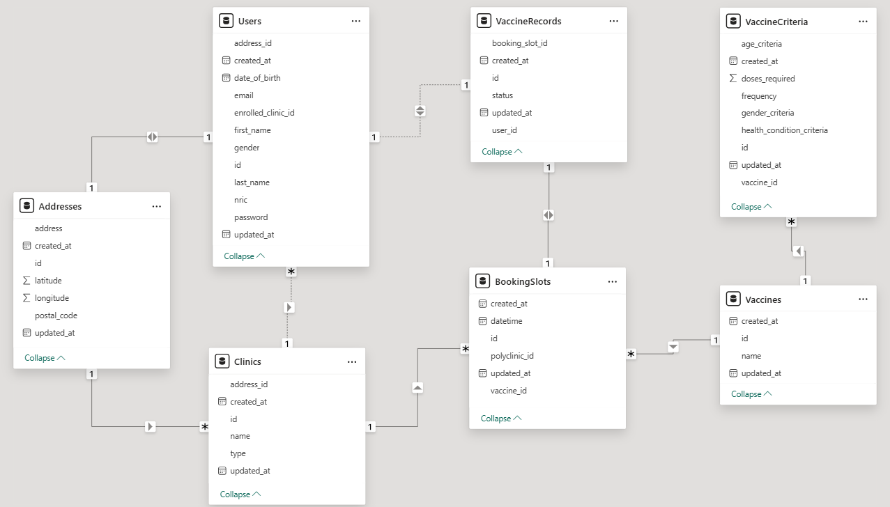

# Database Models

## Table of Contents

- [Entity Relationship Diagram](#entity-relationship-diagram)
- [User](#user)
- [Clinic](#clinic)
- [Address](#address)
- [Vaccine](#vaccine)
- [BookingSlot](#booking-slot)
- [VaccineRecord](#vaccine-record)

## Entity Relationship Diagram 

_Entity Relationship Diagram_

## User 

- **Table Name**: `Users`

- **Columns**:

  - `id` (String, primary key): Unique identifier for each user.

  - `address_id` (String, foreign key, nullable): ID of the address associated with the user.

  - `enrolled_clinic_id` (String, foreign key, nullable): ID of the clinic where the user is enrolled in.

  - `nric` (String, unique): National Registration Identity Card (NRIC) number of the user.

  - `first_name` (String): First name of the user.

  - `last_name` (String): Last name of the user.

  - `email` (String, unique): Email address of the user.

  - `date_of_birth` (Date): Date of birth of the user.

  - `gender` (String): Gender of the user.

  - `password` (String): Hashed password of the user.

- **Relationships**:

  - A user might have a many-to-one relationship with the `Address` table via the `address_id` foreign key.

  - It might also have a many-to-one relationship with the `Clinic` table via the `enrolled_clinic_id` foreign key.

## Clinic 

- **Table Name**: `Clinics`

- **Columns**:

  - `id` (String, primary key): Unique identifier for each clinic.

  - `address_id` (String, foreign key): ID of the address associated with the clinic.

  - `name` (String): Name of the clinic.

  - `type` (String): Type of the clinic. Can be "polyclinic" or "gp".

- **Relationships**:

  - A clinic has a many-to-one relationship with the `Address` table via the `address_id` foreign key.

  - It also has a one-to-many relationship with the `User` table via the `enrolled_clinic_id` foreign key.

  - It also has a one-to-many relationship with the `BookingSlot` table via the `polyclinic_id` foreign key.

## Address 

- **Table Name**: `Addresses`

- **Columns**:

  - `id` (String, primary key): Unique identifier for each address.

  - `postal_coode` (String): Postal code of the address.

  - `address` (String): Full address of the address.

  - `latitude` (Float): Latitude of the address.

  - `longitude` (Float): Longitude of the address.

- **Relationships**:

  - An address has a one-to-many relationship with the `User` table via the `address_id` foreign key.

  - It also has a one-to-many relationship with the `Clinic` table via the `address_id` foreign key.

## Vaccine 

- **Table Name**: `Vaccines`

- **Columns**:

  - `id` (String, primary key): Unique identifier for each vaccine.

  - `name` (String): Name of the vaccine.

  - `price` (Float): Price of the vaccine.

  - `doses_required` (Integer): Number of doses required for the vaccine.

  - `age_criteria` (String): Age criteria for the vaccine.

  - `gender_criteria` (String): Gender criteria for the vaccine.

- **Relationships**:

  - A vaccine has a one-to-many relationship with the `BookingSlot` table via the `vaccine_id` foreign key.

## BookingSlot 

- **Table Name**: `BookingSlots`

- **Columns**:

  - `id` (String, primary key): Unique identifier for each booking slot.

  - `polyclinic_id` (String, foreign key): ID of the polyclinic associated with the booking slot.

  - `vaccine_id` (String, foreign key): ID of the vaccine associated with the booking slot.

  - `datetime` (DateTime): Date and time of the booking slot.

- **Relationships**:

  - A booking slot has a many-to-one relationship with the `Clinic` table via the `polyclinic_id` foreign key.

  - It also has a many-to-one relationship with the `Vaccine` table via the `vaccine_id` foreign key.

## VaccineRecord 

- **Table Name**: `VaccineRecords`

- **Columns**:

  - `id` (String, primary key): Unique identifier for each vaccine record.

  - `user_id` (String, foreign key): ID of the user associated with the vaccine record.

  - `booking_slot_id` (String, foreign key): ID of the booking slot associated with the vaccine record.

  - `status` (String): Status of the vaccine record. Can be "booked" or "completed".

- **Relationships**:

  - A vaccine record has a many-to-one relationship with the `User` table via the `user_id` foreign key.

  - It also has a one-to-one relationship with the `BookingSlot` table via the `booking_slot_id` foreign key.

> [!NOTE]
> All tables also have the `created_at` and `updated_at` columns to track when they were created and last updated.
