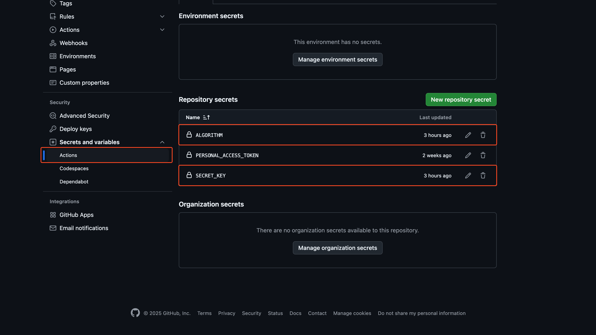
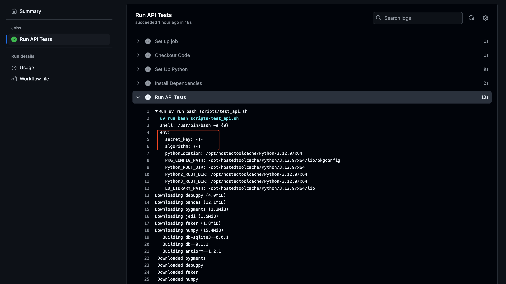

# Debugging GitHub Actions Workflows Locally (with `act`)

To streamline local development and debugging of the GitHub Actions workflows (.yml files) without repeatedly pushing code to GitHub, we use a tool called [**`act`**](https://github.com/nektos/act). `act` allows you to execute GitHub Actions workflows locally, greatly improving the efficiency of testing and debugging workflows before pushing changes.

## Table of Contents

- [Prerequisites](#prerequisites)
- [Running Workflows Locally](#running-workflows-locally)
  - [Configuring GitHub Secrets](#configuring-github-secrets)

## Prerequisites <a id="prerequisites"></a>

- [`act`](https://github.com/nektos/act)
  - For Linux or macOS users, refer to the installation instructions for Homebrew [here](https://nektosact.com/installation/homebrew.html) _(recommended)_.
  - For Windows users, refer to the installation instructions for Chocolatey [here](https://nektosact.com/installation/chocolatey.html) _(recommended)_.
  - For other installation methods, refer [here](https://nektosact.com/installation/index.html#installation-via-software-package-manager).
- [Docker](https://www.docker.com/)
  - For macOS users, follow the steps outlined in [Docker Docs for how to install Docker Desktop for Mac](https://docs.docker.com/desktop/setup/install/mac-install/).
  - For Windows users, please follow steps for [installing Docker Desktop on Windows](https://docs.docker.com/desktop/setup/install/windows-install/).
  - For Linux users, you will need to [install Docker Engine](https://docs.docker.com/engine/install/).

> [!NOTE]
>
> `act` depends on `docker` (exactly Docker Engine API) to run workflows in containers.

## Running Workflows Locally <a id="running-workflows-locally"></a>

Once you have fulfilled the prerequisites, you can run the GitHub Actions workflows locally using the following `act` commands.

- To run a specific job, run:

  ```bash
  act -j test
  ```

  This command runs the `test` job defined in your [`.github/workflows/run-tests.yml`](../.github/workflows/run-tests.yml).

- To run all workflows defined for pull requests, run:

  ```bash
  act pull_request
  ```

- To run a specific workflow file, run:

  ```bash
  act -W ../.github/workflows/run-tests.yml
  ```

> [!IMPORTANT]
> Because `run-tests.yml` requires GitHub secrets, we will need to set it up before running the workflow locally.

### Configuring GitHub Secrets <a id="configuring-github-secrets"></a>

Our backend API tests requires several environment variables to be set before it can run without issues. For more information, refer to the [Environment Variables Configuration](../app/backend/app/README.md#environment-variables-configuration) section of the [Backend API Documentation](../app/backend/app/README.md).

Since the Docker container in which our GitHub Actions workflow will run in does not have access to the environment variables, we need to provide them before running the workflow locally. To set the secrets for the workflow to run locally, create a `.secrets` file in the root directory of the repository and add the environment variables to it — you may also rename the [`.secrets.sample`](../.secrets.sample) and simply fill in the required values. This helps simulate GitHub Action secrets locally.

```yml
secret_key=
algorithm=
```

Next, run the following command:

```bash
act pull_request -W .github/workflows/run-tests.yml --secret-file .secrets --reuse
```

> [!NOTE]
> Here, we are specifying that we want to run the `run-tests.yml` workflow locally using the `pull_request` event. We provide the required environment variables as secrets using the `--secret-file` flag pointing to the `.secrets` file. The `--reuse` flag tells `act` to reuse the container if it already exists (this is recommended as we do not need to rebuild the container every time).

Similarly, our GitHub Actions workflow on GitHub runs in an isolated environment. Therefore, we need to set these environment variables as GitHub secrets before they can run without issues on GitHub. To set the GitHub secrets, first head to the repository **Settings** tab in GitHub and click on **Secrets and variables** on the left panel. Next, select **Actions**. Then click on **New repository secret** and add the environment variables as shown in the following image.



_Setting GitHub Secrets_

Once saved, your subsequent GitHub Actions workflows should run successfully and you can confirm this in the logs of the GitHub Actions workflow run:



_Getting Secrets Successfully_
