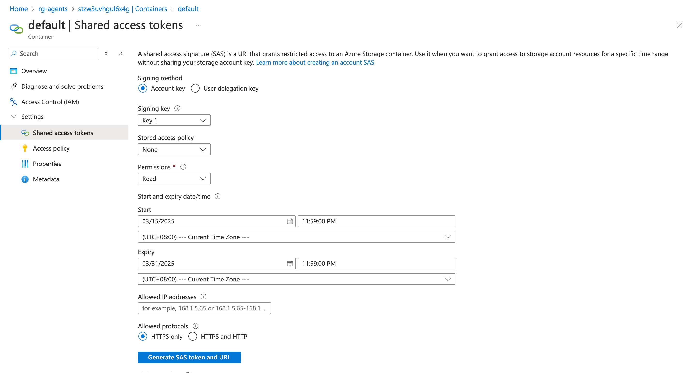

# Development

## Table of Contents

- [Prerequisites](#prerequisites)
- [Overview](#overview)
- [Retrieving Data](#retrieving-data)
- [Azure Integration](#azure-integration)
  - [Managing SAS Token](#managing-sas-token)
- [Data Versioning](#data-versioning)
  - [Data Updates](#data-updates)
  - [Revert Data Version](#revert-data-version)
- [Running locally](#running-locally)

## Prerequisites <a id="prerequisites"></a>

Ensure you have met the [prerequisites](../README.md#prerequisites) in the [Getting Started](../README.md#getting-started) section. Run `dvc --version` to confirm you have DVC installed.

## Overview <a id="overview"></a>

The development data is version-controlled in Azure Blob Storage. Before development, ensure the data is available and up-to-date.

If you are interested, refer to the sections below for more details:

- [Retrieving Data](#retrieving-data) - How to access the development data.
- [Azure Integration](#azure-integration) - Data integration with Azure and roles involved.
- [Data Versioning](#data-versioning) - How to effectively use DVC for managing data versions.

## Retrieving Data <a id="retrieving-data"></a>

In the root of this project, you will find a [`.env.sample`](../.env.sample). It should look like this:

```yaml
AZURE_STORAGE_ACCOUNT=
AZURE_KEY_VAULT=
AZURE_URL=
SECRET_NAME=
```

Create an `.env` file and copy and paste the contents from above into it.

> [!NOTE]
> Consult a [Data Controller](#data-controller) for the required credentials. Once they are set, the SAS token can be retrieved via the [`fetch_sas_token.py`](../scripts/fetch_sas_token.py) file which is called in the`setup_dvc.*` scripts.

Once the environment variables have been set up, you can run the following command to retrieve the SAS token and set up the DVC configurations:

For Linux or macOS users, run:

```bash
./scripts/setup_dvc.sh
```

For Windows users, run:

```powershell
./scripts/setup_dvc.ps1
```

After execution, the script updates all remote data repositories in the [config](../.dvc/config) file and sets credentials in a local configuration file — not version-controlled with Git.

Lastly, run the following command to get the latest version of data respectively:

```bash
./scripts/get_data.sh
```

For Windows, run:

```powershell
./scripts/get_data.ps1
```

After execution, you should see all the data in the [`data`](../data/) folder. It may take a while for all the data to be downloaded if this is your first time pulling them in. For more information, refer to this [user guide](https://dvc.org/doc/user-guide/data-management/remote-storage/azure-blob-storage) on how to integrate DVC with Microsoft Azure Blob Storage.

> [!NOTE]
> If you encounter any issues, please consult a [Data Controller](#data-controller). Usually, an error occurs when the SAS token has expired. If so, please consult the [Managing SAS Token](#managing-sas-token) section to generate a new SAS token.

## Azure Integration <a id="azure-integration"></a>

We are using Azure Blob Storage as our remote storage for DVC.

1. **Data Controller** (Maintains Remote Storage + Google Drive) <a id="data-controller"></a>

   - Controls the data version in Azure.
   - Versions the `.dvc` files with Git (i.e. `git push`) so that [Data Users](#data-user) can retrieve the correct data version from the remote storage.
   - Updates the data files in Google Drive, for [Data Viewers](#data-viewer) to view the data.
   - Manages the Azure resources.
   - Generates, stores and updates the SAS token as a Secret in Azure Key Vault.

> [!NOTE]
> Refer to the [Managing SAS Token](#managing-sas-token) section for more information on how to manage the SAS token required for DVC to interact with Azure Blob Storage.

2. **Data User** (Interacts with Remote Storage) <a id="data-user"></a>

   - Pulls in versioned-controlled data:
     - Run `git pull` to retrieve latest `.dvc` files.
     - Run the `get_data.*` scripts to retrieve the latest data for development.

> [!NOTE]
> Refer to [Retrieving Data](#retrieving-data) for more details on the steps to retrieve the latest data

3. **Data Viewer** (Interacts with Google Drive) <a id="data-viewer"></a>

   - Views raw data found in the Google Drive.

### Managing SAS Token <a id="managing-sas-token"></a>

We use SAS Token as our authentication method to set up the remote configuration to the Azure Blob Storage. The [Data Controller](#data-controller) will perform the steps to generate the SAS token. For more information, refer to this [user guide](https://dvc.org/doc/user-guide/data-management/remote-storage/azure-blob-storage) on how to integrate DVC with Microsoft Azure Blob Storage.



_Steps to Generate SAS Token_

**Steps (Generate SAS token)**:

1. Create an **Azure Storage Account**
2. Click on **$+$ Container** > Enter a name for your container > **Create**
3. Click on your new container > Under **Settings** > Click on **Shared access token**
4. Under **Signing method** > Select **Account key**
5. Under **Permissions** > Check **Read**, **Write**, **Delete** and **List**
6. Under **Start** and **Expiry** > Set the date and time
7. Under **Allowed protocols** > Select **HTTPS only**
8. Click on **Generate SAS token and URL** > Copy the SAS token

> [!CAUTION]
> Once you exit the Azure page, you can no longer find the SAS token as Azure does not store it. It is important for [**Data Controllers**](#data-controller) to note down the following details of the latest SAS token:
>
> 1. Creation Date
> 2. Expiration Date
> 3. SAS Token
> 4. (Optional) Blob SAS URL

## Data Versioning <a id="data-versioning"></a>


_Versioning workflow in DVC and Git: This diagram illustrates how data updates are tracked using DVC while code changes are managed through Git. The HEAD in Git moves with `git checkout`, while `dvc checkout` retrieves the corresponding data version. Tagged versions (`v1.0.0`, `v1.1.0`, `v2.0.0`) represent different stages of the dataset, ensuring reproducibility across data updates._

### Data Updates <a id="data-updates"></a>

When you have made an update or change to the data, you can run the following commands to version the newly updated data:

```bash
dvc add <PATH_TO_RAW_DATA>

# or you can simply run `dvc push --remote <REMOTE_NAME>` if you've only staged a single raw data
dvc push <PATH_TO_RAW_DATA> --remote <REMOTE_NAME>
```

You should see an updated version of a `.dvc` file of your updated data. It is best practice to version control this `.dvc` file with Git whenever a change has been made to any data. This `.dvc` file tracks the versioning of your data and is crucial when you want to revert back to a previous version of your data. You may run the following commands to track changes in Git:

```bash
git add <PATH_TO_RAW_DATA>.dvc
git commit -m "chore: raw data updated; version control new .dvc file"
git push
```

### Revert Data Version <a id="revert-data-version"></a>

If and when you wish to revert back the data to a previous version, you can run the following commands to retrieve it back:

```bash
git log # view commit log to find specific commit to revert back to
git checkout <COMMIT_HASH>
dvc checkout # reverts local raw data version
```

You should see a reverted version of a `.dvc` file of your reverted data. It is best practice to version control this `.dvc` file with Git whenever a change has been made to any data. This `.dvc` file tracks the versioning of your data and is crucial when you want to revert back to a previous version of your data. You may run the following commands to track changes in Git:

```bash
git checkout main
dvc add <PATH_TO_RAW_DATA>
dvc push <PATH_TO_RAW_DATA> --remote <REMOTE_NAME>
git add .
git commit -m "chore: revert data version; version control previous .dvc file"
git push
```

## Running locally <a id="running-locally"></a>

1. `cd` to root folder
2. Run the following command in your terminal

   ```bash
   make run-server
   ```

3. This will install the `uv` package, syunc the dependencies and run the FastAPI server
4. Navigate to url shown in terminal
