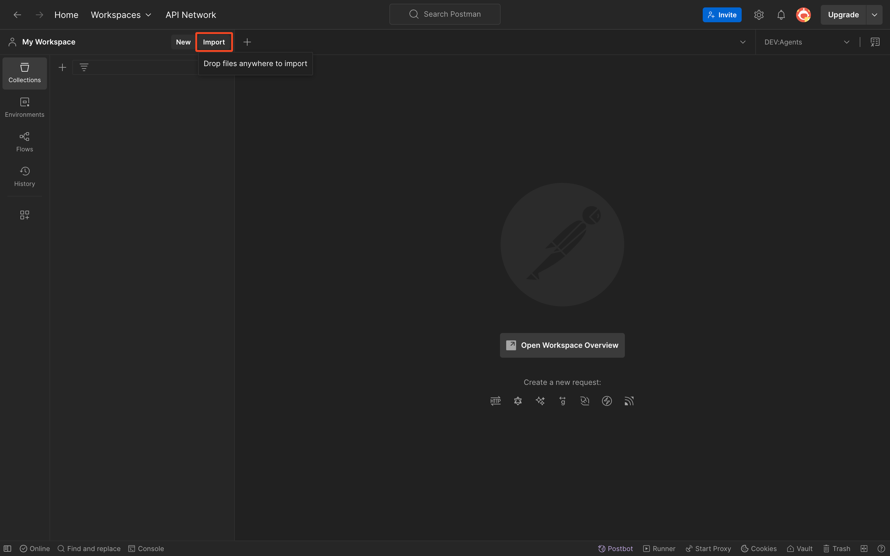
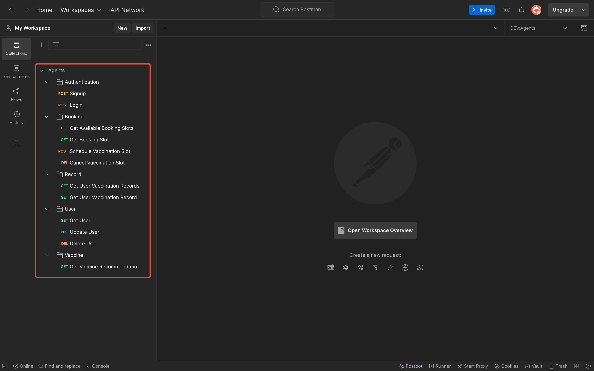
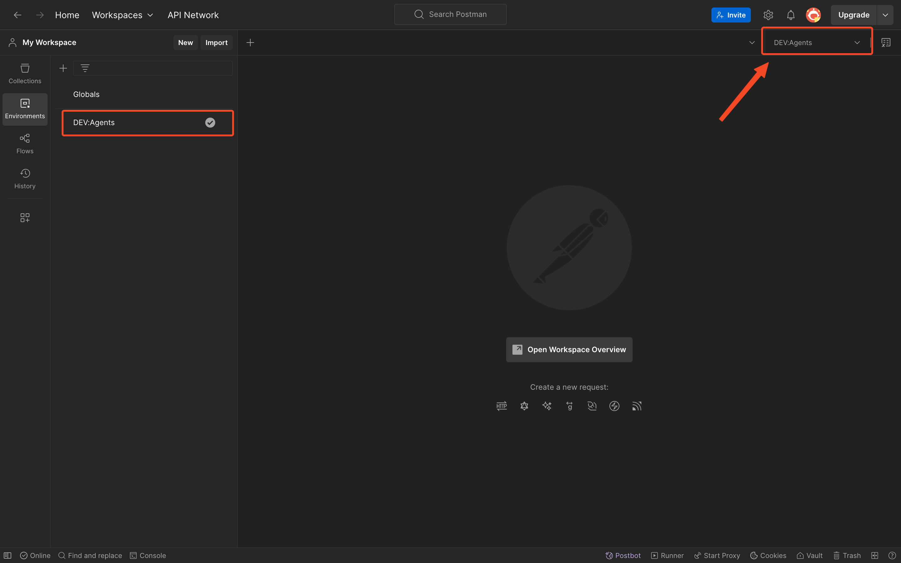
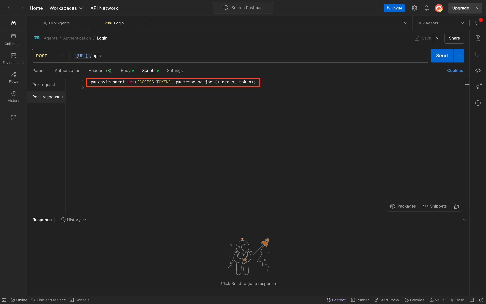
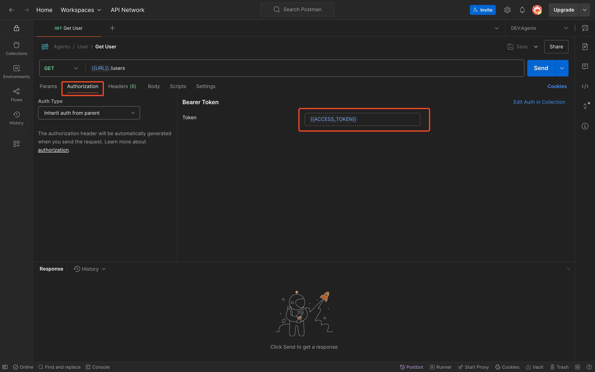
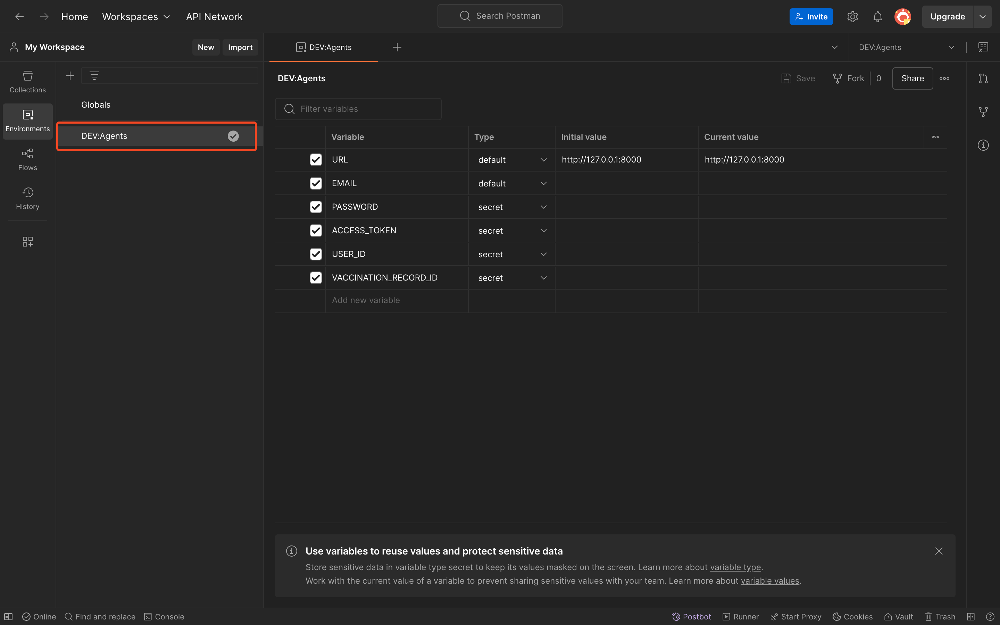
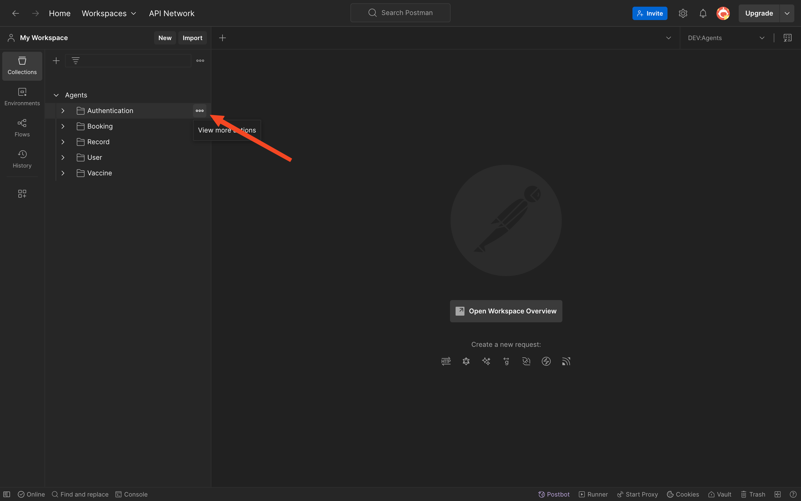

# Postman Testing

## Table of Contents

- [Postman Step-by-Step Guide](#postman-step-by-step-guide)
- [Configuring Environment Variables in Postman](#configuring-environment-variables-in-postman)
- [Using the API Collection (Sending Requests)](#using-the-api-collection-sending-requests)
- [Sharing and Exporting Collections/Environments](#sharing-and-exporting-collections-environments)

While the [interactive docs](API_ENDPOINTS.md#swagger-ui-reference) are useful, many developers prefer using Postman for API testing, especially for more complex workflows or automated testing. Postman is also useful for non-developers to test APIs through a GUI. We have provided [Postman Collections](../postman/Agents.postman_collection.json) and [Environment](../postman/DEV-Agents.postman_environment.json) files to make testing our API easier. Here’s how to use them:

## Postman Step-by-Step Guide 

To get started with Postman:

1. **Install Postman**: If you don’t have Postman installed, download it from the [official website](https://www.postman.com/downloads/) and install it.

2. **Import the Collection**: We provide a [Postman Collection](../postman/Agents.postman_collection.json) (a `.postman_collection.json` file) that contains all the API endpoints grouped and pre-configured with sample requests. In Postman, click the **Import** button (usually found in the top-left corner or in the File menu). In the import dialog, select the collection JSON file.

   

   _Import the Collection_

   Postman will import it, and you should see a new Collection on the left sidebar with the name of our project’s API. This collection includes folders or requests organized by module (e.g., Authentication, Booking, Record, matching the sections [here](API_ENDPOINTS.md)).

   

   _Postman Collection_

3. **Import the Environment**: We also provide a [Postman Environment](../postman/DEV-Agents.postman_environment.json) file (a `.postman_environment.json` file). This contains variables like the base URL of the API and any tokens you might use. Click **Import** again and select the environment JSON file. Once imported, go to the **Environments** dropdown in the top-right corner of Postman and select the imported environment. This will activate those variables.

   

   _Postman Environment_

   - **What are environment variables?** They are placeholders in Postman that store values (like URLs, tokens, user IDs, etc.) so that you don’t have to type them in every request. For example, our collection uses `{{URL}}` in each request’s URL, and in the environment file, `URL` is defined as `http://127.0.0.1:8000` by default (for local testing). Postman will substitute the actual value when sending [^1].

4. **Verify Variables**: After selecting the environment, you can verify the variables by clicking the eye icon next to the environment dropdown, or by managing the environment. Ensure that `URL` is correct (change it if your server is running on a different host/port), and check if there are other variables you need to set (which might initially be empty). Refer to the section [below](#configuring-environment-variables-in-postman) on how to configure the Postman environment variables. The Postman script in the image below will automatically set the token after calling the `/login` endpoint successfully. Subsequent requests will use this token in the `Authorization` header.

   

   _Setting Access Token_

   

   _Access Token_

At this point, you have the collection and environment set up in Postman. All the endpoints are available as requests you can send.

## Configuring Environment Variables in Postman 

Before testing endpoints that require authentication or other dynamic data, you might need to configure some environment variables in Postman. To do this, locate the environment in the left panel and click on the environment name. You will see a list of variables as shown in the image below:

_Setting Postman Environment Variables_

For our project, the environment likely includes:

- `URL`: The base address of the API (e.g., `http://127.0.0.1:8000` for local testing). If you are testing against a deployed server, change this to the deployed URL (e.g., `https://api.myproject.com`).

- `EMAIL`: The email address of a user in the system (e.g., `jdoe@myproject`).

- `PASSWORD`: The password for the user (e.g., `password123`).

> [!NOTE]
> The `ACCESS_TOKEN`, `USER_ID` and `VACCINATION_RECORD_ID` are automatically set when calling the `/login`, `/signup` and `/bookings/schedule` endpoints, respectively.

If you need to add new variables, you can do so. Remember to click **Save** after making changes to the environment.

## Using the API Collection (Sending Requests) 

With the collection and environment ready, you can start testing the API endpoints:

- **Select an endpoint**: In the left sidebar, under the imported collection, click on an endpoint you want to test (for example, “Login” under an “Authentication” folder, or “Get Available Booking Slots” under a “Booking” folder). The request details will appear in the main area.

- **Ensure correct data**: Check if the request has any placeholders (like `{{URL}}` in the URL, which should be taken care of by the environment). For endpoints that require a request body (like `POST`/`PUT`), Postman will have a sample JSON body pre-filled (if provided in the collection). You can edit this body as needed. For example, when creating a new booking, fill in realistic data for the new booking in the JSON body.

- **Send the request**: Click the **Send** button. Postman will send the HTTP request to the API and you will see the response at the bottom section, including the response body, status code, and headers. For instance, a successful `GET` request might return a `200 OK` with a JSON list of bookings in the body. If something is wrong (e.g., unauthorized or validation error), you might see a `401` or `422` status with an error message.

- **Examine the response**: Verify that the response data is what you expect. This is where QA or product managers can check that the API is returning the correct information. For example, if you created a new booking, doing a `GET` on that booking’s URL should return the details you sent, along with an assigned `id`.

- **Using variables in requests**: Our Postman collection likely uses variables for things like IDs. For example, a request to `/bookings/{id}` might actually be in Postman as `GET {{URL}}/bookings/{{BOOKING_SLOT_ID}}`. In the environment, you’d set `BOOKING_SLOT_ID` to a real ID (perhaps obtained from a previous response) before sending the request. Postman also allows scripting to automate this (like capturing an ID from one request and storing it into a variable for the next request), which is included in the collection. You can always manually set the variable or directly replace `{{BOOKING_SLOT_ID}}` with a number in the request URL for quick testing.

Postman’s interface makes it easy to sequence calls: for example, log in (get token), then automatically use that token for subsequent calls. You could even use the Collection Runner to run through a series of calls (like a full scenario test) or write tests within Postman to assert certain responses. Those are advanced uses — at minimum, using the collection interactively as described will help you validate each API endpoint.

## Sharing and Exporting Collections/Environments 

If you make changes to the Postman collection (for example, adding a new request as you develop a new endpoint) or update environment variables, you might want to share these updates with the rest of the team:

- **Exporting**: You can export the collection or environment JSON from Postman. To do this for a collection, click the ••• (three dots) next to the collection name in Postman and choose **Export**. Do the same for the environment by going to left panel, selecting the environment, and choosing **Export**. Postman will generate a `.postman_collection.json` or `.postman_environment.json` file respectively. These files can be checked into your repository or sent to team members. Postman data is in JSON format, which makes it easy to version control. (It’s a good practice to update these files in the repo whenever API changes are made, so everyone stays in sync with the latest endpoints)[^1].

  

  _Exporting Collections/Environments_

- **Team Workspace**: Alternatively, if our team uses Postman’s collaboration features (like a shared workspace or the Postman cloud), you can push the updated collection to the team workspace so that others automatically get the new version. This requires all team members to use Postman with a login and join the workspace.

- **Documentation**: Postman collections can also be published as documentation. However, since we already have the Swagger UI and this document, maintaining a separate Postman documentation might be unnecessary. The collection is primarily for convenience in testing.

> [!CAUTION]
> Remember to not include sensitive information when sharing collections or environments. For instance, don’t accidentally save your actual tokens or passwords in an environment file that gets committed. Your provided environment template should either leave those blank or uses dummy values (e.g., `YOUR_TOKEN_HERE`). Each user should insert their own run-time secrets.

By following this Postman guide, even non-developers can independently test the API endpoints in a controlled environment, using realistic data, without having to write any code. It’s a great way for a product manager or tester to validate that “when I do X, the API returns Y” as described in requirements.

[^1]: [Data import and export in Postman](https://learning.postman.com/docs/getting-started/importing-and-exporting/importing-and-exporting-overview/#:~:text=,API%20specifications%20into%20Spec%20Hub)
